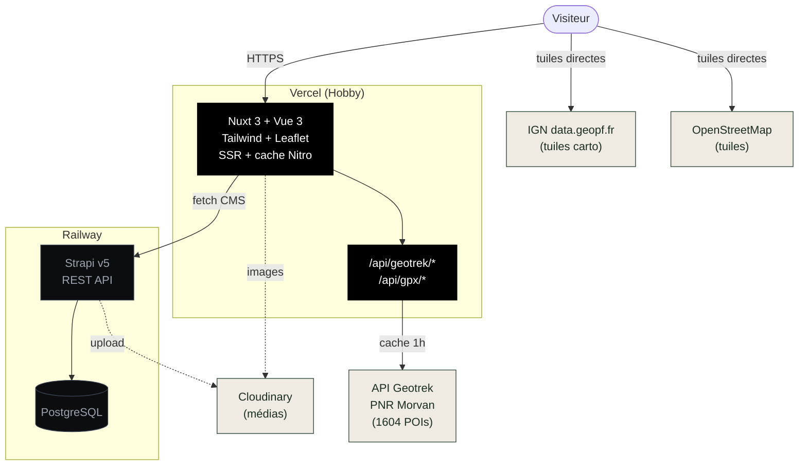

# Site associatif de Cussy-en-Morvan

Site officiel de l'association du village de Cussy-en-Morvan (Bourgogne). Plateforme généraliste pour présenter la vie associative : balades (VTT, randonnée pédestre…), événements, actualités, patrimoine local.

- **Backend** : Strapi v5 (CMS headless) — `backend/`
- **Frontend** : Nuxt 3 + Tailwind + Leaflet — `frontend/`

Lecture libre pour tous les visiteurs. Contenu géré via le backoffice Strapi (association + contributeurs).

---

## Stack

| Couche | Techno | Hébergement actuel |
|---|---|---|
| CMS | Strapi v5 (Node 22) | Railway (en cours de migration vers GCP) |
| Base | PostgreSQL | Railway (→ Cloud SQL) |
| Médias | Cloudinary | — |
| Front | Nuxt 3 (Vue 3, TS) | Vercel (→ Cloud Run ou GKE) |
| Carte | Leaflet + OpenStreetMap | — |

Migration GCP en cours : voir [`DEPLOY.md`](./DEPLOY.md) pour la cible (Cloud Run / GKE).

---

## Architecture (actuelle)



---

## Démarrage local

### 1. Backend Strapi

```bash
cd backend
cp .env.example .env
# Optionnel : remplacer les secrets dans .env
npm install
npm run develop
```

L'admin Strapi s'ouvre sur <http://localhost:1337/admin>. Première exécution : créer le compte super admin.

Par défaut la base est en **SQLite** (`.tmp/data.db`). Pour passer à PostgreSQL, voir [`DEPLOY.md`](./DEPLOY.md).

#### Configuration des permissions

Dans **Settings → Users & Permissions Plugin → Roles → Public**, cocher `find` et `findOne` sur les collections `chemin`, `balade`, `actualite`, `evenement`, `tag`. Sinon le frontend obtiendra des 403.

Créer ensuite un rôle **Éditeur** depuis **Settings → Administration Panel → Roles → Create new role** avec les droits create / read / update / publish (pas delete) sur les mêmes collections.

### 2. Frontend Nuxt

```bash
cd frontend
cp .env.example .env
npm install
npm run dev
```

Accessible sur <http://localhost:3000>.

---

## Modèle de données

### Collection `chemin`
Tronçon GPX unitaire avec statut (`ouvert` / `deconseille` / `ferme`), distance, dénivelé, type de surface.

### Collection `balade`
Itinéraire composé d'un ou plusieurs `chemin` (relation many-to-many). Caractéristiques :
- `difficulte` : `famille` / `intermediaire` / `expert`
- `type_parcours` : `boucle` / `hameaux` / `aller_retour` / `libre`
- `locomotion` : JSON décrivant les modes de pratique autorisés (VTT, randonnée pédestre, etc.)
- `duree_minutes`, `duree_estimee`, `point_depart`, `conseils`
- Relation many-to-many vers `tag` (thématiques transverses)
- `slug` (UID auto-généré) utilisé comme paramètre d'URL `/balades/[slug]`

### Collection `evenement`
Événement daté de l'association (rando organisée, manifestation, AG…). Champs :
- `titre`, `slug`, `date_debut`, `date_fin`, `lieu`
- `contenu` (richtext), `image_couverture`, `flyer`
- Relation many-to-one optionnelle vers `balade` (un événement peut être rattaché à une balade)

### Collection `actualite`
News datées avec catégorie (info / conditions / nouveauté). Peut être liée à une balade.

### Collection `tag`
Tag thématique réutilisable (ex. *forêt*, *panoramique*, *famille*). Champs : `nom`, `slug`, `couleur` (code hex). Relation many-to-many vers `balade`.

Les schemas sont dans `backend/src/api/*/content-types/*/schema.json`.

---

## Pages frontend

| Route | Rôle |
|---|---|
| `/` | Accueil |
| `/balades` et `/balades/[slug]` | Liste et détail des balades |
| `/chemins` | Catalogue des tronçons GPX |
| `/evenements` et `/evenements/[slug]` | Agenda associatif |
| `/actualites` et `/actualites/[slug]` | Fil d'actualités |
| `/patrimoine` | Patrimoine local (POI Geotrek) |
| `/qui-sommes-nous` | Présentation de l'association |
| `/api/health` | Healthcheck (pour les probes orchestrateur) |

---

## Déploiement

### Cible : GCP (en cours)

Le projet est conteneurisé (`frontend/Dockerfile`, `backend/Dockerfile`) pour être déployable indifféremment sur **Cloud Run** ou **GKE**. Voir [`DEPLOY.md`](./DEPLOY.md) pour les variables d'environnement, exemples de commandes `gcloud run deploy`, configuration Cloud SQL et migration des données depuis Railway.

### Actuel : Railway + Vercel

#### Backend sur Railway

1. Créer un nouveau projet Railway, ajouter un service **PostgreSQL**.
2. Créer un second service depuis le dossier `backend/` (déploiement depuis le repo Git).
3. Variables d'environnement à définir :

   ```
   NODE_ENV=production
   APP_KEYS=<générer 4 clés aléatoires séparées par virgule>
   API_TOKEN_SALT=<aléatoire>
   ADMIN_JWT_SECRET=<aléatoire>
   TRANSFER_TOKEN_SALT=<aléatoire>
   JWT_SECRET=<aléatoire>

   DATABASE_CLIENT=postgres
   DATABASE_URL=${{Postgres.DATABASE_URL}}
   DATABASE_SSL=true
   DATABASE_SSL_REJECT_UNAUTHORIZED=false

   CLOUDINARY_CLOUD_NAME=<…>
   CLOUDINARY_API_KEY=<…>
   CLOUDINARY_API_SECRET=<…>
   ```

4. Build command : `npm run build` — Start command : `npm run start`.
5. Une fois déployé, créer un **API Token** dans Strapi (Settings → API Tokens → Create new token, type *Read-only*) et copier la valeur.

#### Frontend sur Vercel

1. Importer le repo, sélectionner le dossier `frontend/` comme **Root Directory**.
2. Framework Preset : Nuxt — Vercel détecte automatiquement.
3. Variables d'environnement :

   ```
   STRAPI_URL=https://<votre-app-strapi>.up.railway.app
   STRAPI_API_TOKEN=<token créé à l'étape précédente>
   NUXT_PUBLIC_STRAPI_URL=https://<votre-app-strapi>.up.railway.app
   ```

4. Déployer.

---

## Structure

```
.
├── backend/                  # Strapi v5
│   ├── src/api/
│   │   ├── actualite/
│   │   ├── balade/
│   │   ├── chemin/
│   │   ├── evenement/
│   │   └── tag/
│   ├── config/
│   ├── Dockerfile
│   └── package.json
├── frontend/                 # Nuxt 3
│   ├── components/
│   ├── composables/
│   ├── pages/
│   ├── server/api/           # proxy GPX, Geotrek, healthcheck
│   ├── types/
│   ├── Dockerfile
│   └── nuxt.config.ts
└── DEPLOY.md                 # Guide de déploiement GCP
```

---

## Notes

- Les fichiers GPX hébergés sur Strapi/Cloudinary sont servis via le proxy Nuxt `/api/gpx/[documentId]` afin d'éviter les soucis CORS et de bénéficier du cache Nitro (1h).
- Le composant `BaladeMap.vue` est rendu dans un `<ClientOnly>` car Leaflet manipule directement le DOM.
- Le rendu du Rich Text Strapi se fait via `v-html` après sanitisation par DOMPurify (composable `useSanitize`).
